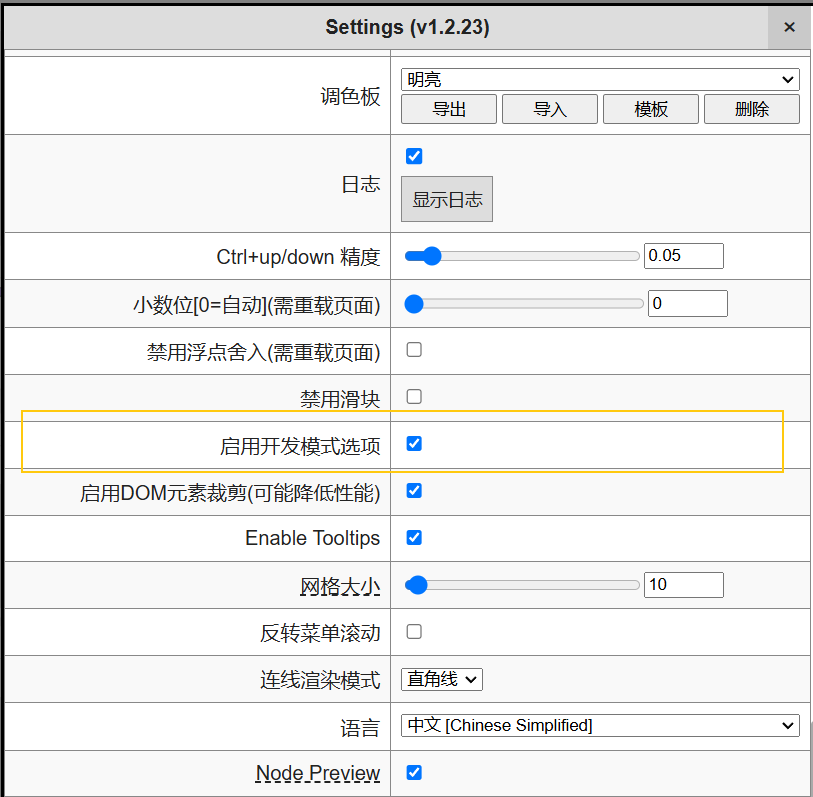
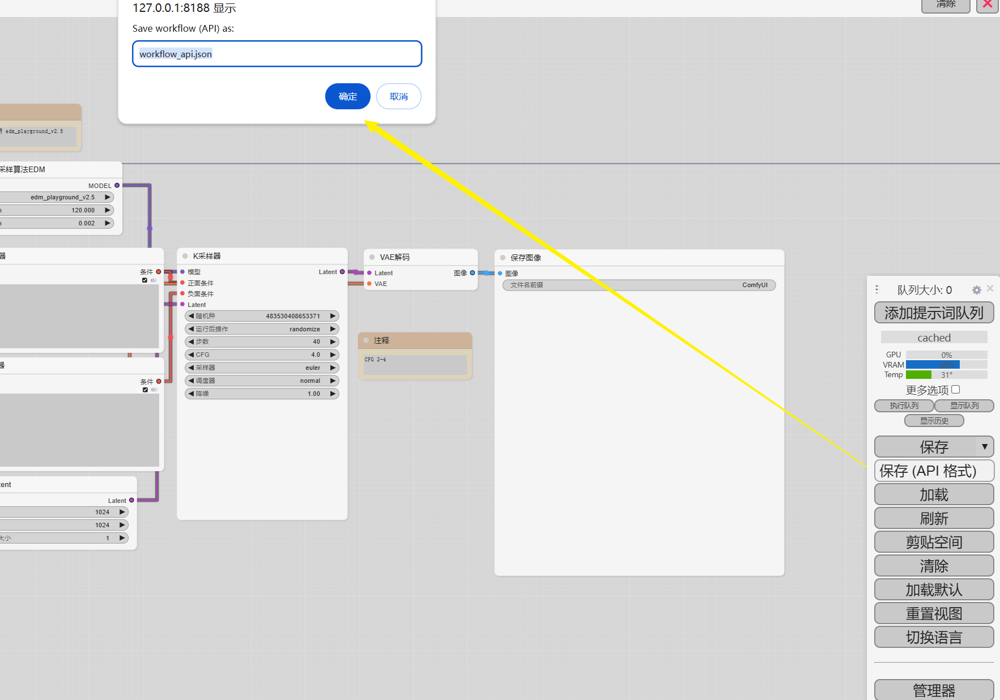
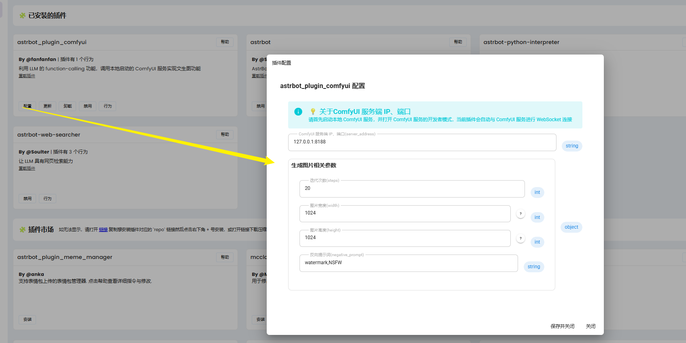
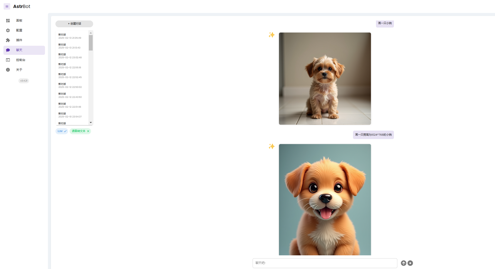
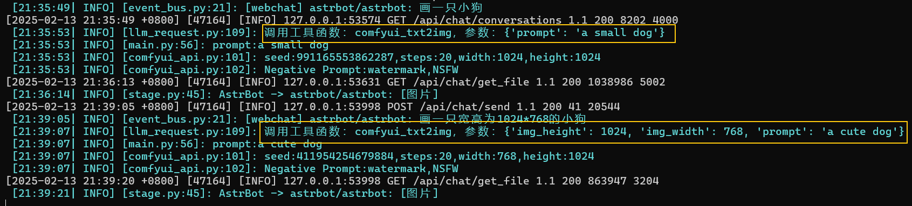

# 功能
专为 **[AstrBot](https://github.com/Soulter/AstrBot)** 项目开发的插件，利用 LLM 的 function-calling 功能，调用本地启动的 ComfyUI 服务实现文生图功能！

# 使用方式
1、将该插件项目克隆到 **[AstrBot](https://github.com/Soulter/AstrBot)** 项目的 `/AstrBot/data/plugins`目录下，或者直接在 **[AstrBot](https://github.com/Soulter/AstrBot)** 项目的插件面板中安装该插件

2、下载依赖库

在 **[AstrBot](https://github.com/Soulter/AstrBot)** 项目所在的 Python 环境下安装 
```shell
pip install websocket-client==1.8.0
```

3、下载安装并启动 [ComfyUI](https://github.com/comfyanonymous/ComfyUI) 服务，同时打开 ComfyUI 服务的开发者模式


4、创建一个 ComfyUI 工作流，并将工作流保存为 json 文件，且文件命名必须为 `workflow_api.json`， 然后将文件放到该插件的 `astrbot_plugin_comfyui/workflow` 目录下


5、对插件进行配置

* 其中 `server_address` 为 ComfyUI 服务的IP地址、端口，默认为 `127.0.0.1:8188`

* 图片的宽度、高度优先解析提示词中的宽度、高度，如果没有解析到，则使用配置中的图片宽度、高度



6、在 **[AstrBot](https://github.com/Soulter/AstrBot)** 项目中配置一个支持 function-calling 功能的大语言模型，如 qwen2

7、向大语言模型进行提问，如
> 画一只小狗

> 画一只宽高为1024*768的小狗



查看控制台输出，是否触发了该插件对应的 function-calling 调用
